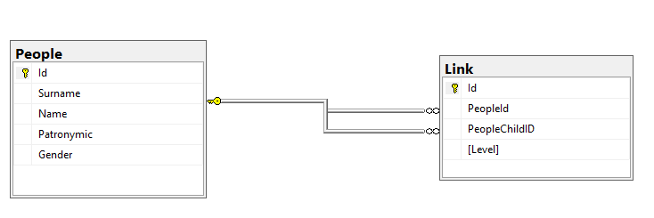

# Веб-сервис фамильное древо

Данный веб-сервис был разработан в рамках тестового задания.

На главной странице веб-сервиса расположена форма с полями
 - Фамилия
 - Имя
 - Отчество

После нажатия на кнопку найти, сервис начнет искать в локальной БД записи о бабушках, а так же правнуках. Если введенный ФИО не будет найден, то будет выдана ошибка о не найденном человеке в БД. Если у человека не будет найдены внуки, или бабушки, то будет выведена надпись "Не найдено данных".

## Используемый стек технологий
 - C#
 - ASP.NET + Razor
 - EntityFramework

Используется стандартный подход реализации веб приложений MVC.

## Структура БД

В проекте используется база данный MSSQL. Помимо 2 таблиц, присутствует функция SQL для выборки бабушек и их правнуков.

## Установка

Для установки данного веб сервиса понадобиться проделать следующие шаги:
 - Слконировать репозиторий
 - Установить зависимости
 - Указать настройки подключения к БД в файле `appsettings.json`
 - Прописать команды
   - `EntityFrameworkCore\Update-Database`
 - Убедиться что порт 80 и 443 свободен
 - Запустить проект в режиме Debug/Release